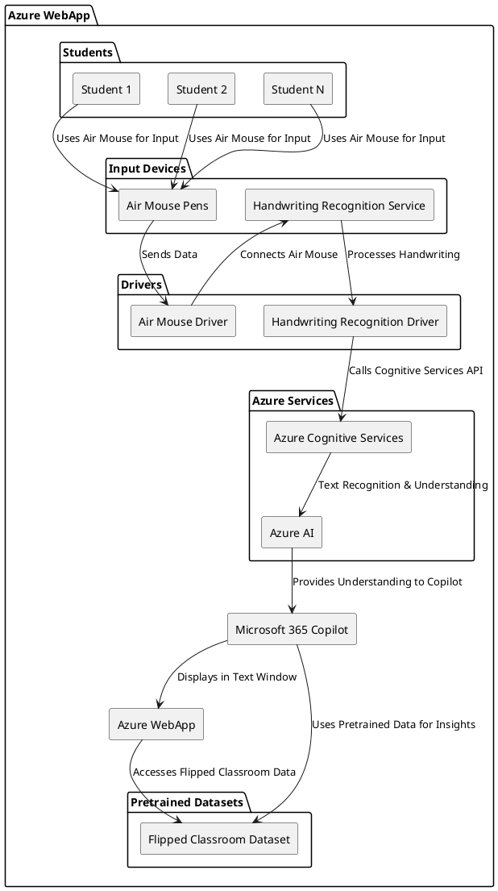

# UNICEF Learning Passport Flipped Classroom
Trying to get a parasol yurt classroom going with a single computer and projector and N kids with LCD pads and air mice

### Inspiration
The UNICEF Microsoft Learning Passport  Classroom was inspired by the need to create an inclusive and interactive learning environment that fosters collaboration and engagement among students, especially in underserved communities.

### What it does
The UNICEF Classroom leverages innovative technology, including BLE styluses or air mouse pens and passive LCD paper, to facilitate an interactive flipped classroom experience. It empowers students to learn collaboratively, enhancing engagement and understanding through real-time feedback and personalized learning paths.

### How we built it
We developed the platform using Azure, integrating BLE technology with user-friendly interfaces. Our team collaborated with educators and technologists to design interactive tools that align with active learning methodologies.

### Challenges we ran into
We faced challenges in ensuring seamless connectivity between multiple BLE devices and the app. Additionally, creating an intuitive user experience for both teachers and students required extensive testing and feedback.

### Accomplishments that we're proud of
We are successfully launching a pilot program in several UNICEF Microsoft Learning Passport schools, intending to receiving positive feedback from both students and educators. Our technology should be praised for enhancing student participation and collaboration.

### What we learned
We learned the importance of user feedback in refining our technology. Engaging with educators helped us understand classroom dynamics and adapt our platform to better meet their needs.

### What's next for The UNICEF Classroom
Moving forward, we plan to expand our reach to more schools globally, integrating additional features based on user feedback. We aim to enhance the platform's capabilities to support diverse learning styles and environments.

Here’s a draft of the `README.md` for your Azure WebApp of Microsoft 365 Copilot integrated with air mouse pens for a classroom setting:

---

# Microsoft 365 Copilot for Flipped Classroom with Air Mouse Pen Handwriting Recognition

This project is an **Azure WebApp** that integrates **Microsoft 365 Copilot** for a flipped classroom setting. It is pretrained with datasets specifically for flipped classroom pedagogy. The application enables students to use **air mouse pens** for handwriting input, which is recognized and processed in real-time, providing seamless integration with the classroom workflow.

The architecture is built on Azure services, leveraging **Azure Cognitive Services** and **Azure AI** for handwriting recognition and analysis. The system captures handwriting input from every student's air mouse and displays recognized text in the application interface.

## Architecture

Below is the high-level architecture represented in PlantUML:



## Components

### 1. **Azure WebApp**
   - Hosts the application, providing the interface for teachers and students.
   - Integrates with Microsoft 365 Copilot for classroom interactions.

### 2. **Microsoft 365 Copilot**
   - AI-powered assistant that helps streamline classroom activities.
   - Uses pretrained datasets for the flipped classroom model to provide context-specific assistance.

### 3. **Pretrained Datasets**
   - Datasets specifically tailored for flipped classroom pedagogy.
   - Copilot accesses these datasets to offer insights and assistance during lessons.

### 4. **Air Mouse Pens**
   - Handheld devices used by students to input handwritten data.
   - The data is processed in real-time to recognize handwriting and convert it into text.

### 5. **Handwriting Recognition Service**
   - A service that processes the input from air mouse pens and converts handwriting to digital text.
   - Integrates with Azure Cognitive Services for high-accuracy recognition.

### 6. **Drivers**
   - **Air Mouse Driver**: Communicates between air mouse pens and the system.
   - **Handwriting Recognition Driver**: Handles the processing and submission of handwriting data to Azure services.

### 7. **Azure Cognitive Services**
   - API that provides handwriting recognition capabilities.

### 8. **Azure AI**
   - Powers the AI logic behind text recognition and understanding.
   - Enables Copilot to interpret and process the recognized handwriting.

### 9. **Students**
   - Each student in the classroom uses an air mouse pen to write their input, which is captured and displayed by the system.

## Prerequisites

- Azure subscription for hosting the WebApp.
- Access to Microsoft 365 for Copilot integration.
- Air mouse pens for student interaction.
- Pretrained datasets for flipped classroom teaching.
- Azure Cognitive Services for handwriting recognition.

## Setup Instructions

1. **Clone the repository**:
   ```bash
   git clone https://github.com/your-repo/classroom-copilot-handwriting
   cd classroom-copilot-handwriting
   ```

2. **Set up the Azure WebApp**:
   - Create a new Azure WebApp and deploy the application.
   - Configure the WebApp to connect with Microsoft 365 and the flipped classroom dataset.

3. **Configure Handwriting Recognition**:
   - Ensure the handwriting recognition driver is installed and connected to Azure Cognitive Services.
   - Set up air mouse pen drivers to allow student input to be captured.

4. **Deploy the solution**:
   - Deploy the web app to Azure and ensure it integrates with Copilot and handwriting recognition services.

## License

This project is licensed under the MIT License. See the [LICENSE](LICENSE) file for details.

---

This `README.md` provides a clear description of the project, the architecture, and instructions for setting up the system. Let me know if you need any changes!
